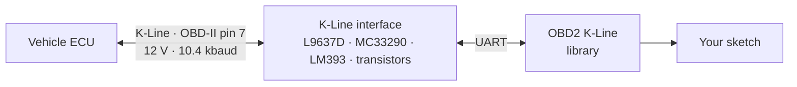

<a id="readme-top"></a>

<div align="center">



# OBD2 K-Line Library

**Vehicle diagnostics over the K-Line for Arduino and ESP32.**<br>
One library for universal OBD-II (ISO 9141-2, ISO 14230-4 / KWP2000) and for manufacturer protocols — VAG KW1281, BMW DS2 and Opel KW82. It handles the handshake, framing, checksums and timing, so your sketch only asks for the data.

<p>
  <a href="https://github.com/muki01/OBD2_KLine_Library/stargazers"></a>
  <a href="https://github.com/muki01/OBD2_KLine_Library/network/members"></a>
  <a href="https://github.com/muki01/OBD2_KLine_Library/issues"></a>
  <a href="LICENSE"></a>
  <a href="https://github.com/muki01/OBD2_KLine_Library/commits/main"></a>
  <a href="https://github.com/muki01/OBD2_KLine_Library/actions/workflows/arduino-ci.yml"></a>
</p>

<p>
  <a href="https://github.com/muki01/OBD2_KLine_Library/releases/latest"></a>
  <a href="https://www.ardu-badge.com/OBD2%20K-Line"></a>
  <a href="https://registry.platformio.org/libraries/muki01/OBD2%20K-Line"></a>
  <a href="#-wiring"></a>
  <a href="#-wiring"></a>
</p>

**[Installation](#-installation)** · **[Quick Start](#-quick-start)** · **[Protocols](#-supported-protocols)** · **[API](#-api-reference)** · **[Wiring](#-wiring)** · **[Examples](#-examples)** · **[License](#-license)**

</div>

---

## 🌟 Overview

**K-Line** is the single-wire diagnostic bus found on most European and Japanese vehicles built between roughly **1987 and 2010**, before CAN became mandatory. This library lets an Arduino, ESP32 or similar microcontroller talk directly to the vehicle's ECU over that wire — no ELM327 adapter in between.

It covers both layers of K-Line diagnostics:

- **Generic OBD-II** — the legislated services every compliant car answers: live data, freeze frame, trouble codes, vehicle information.
- **Manufacturer protocols** — the deeper, car-specific access that generic OBD-II never exposes.



## ❓ Does Your Vehicle Use K-Line?

Look at the OBD-II connector under the dashboard:

- ✅ **Pin 7 populated → K-Line** (ISO 9141 / ISO 14230). This library will work.
- ❌ **Only pins 6 and 14 populated → CAN bus.** Use the [OBD2 CAN Bus Library](https://github.com/muki01/OBD2_CAN_Bus_Library) instead.

<table>
  <tr>
    <td width="50%"></td>
    <td width="50%"></td>
  </tr>
  <tr>
    <td align="center"><b>K-Line</b> — pin 7</td>
    <td align="center"><b>CAN bus</b> — pins 6 and 14</td>
  </tr>
</table>

## ✨ Features

- 🧩 **Six protocols, one API** — the packet format is a setting, not a rewrite of your sketch.
- 🔍 **Automatic detection** — finds the protocol on its own when you do not yet know what the car speaks.
- 🤝 **Flexible initialization** — 5-baud slow init, fast init, ping and handshake-free modes, each selectable independently of the protocol.
- 🧮 **Handles the plumbing** — headers, length bytes, checksums, echo removal and handshake timings are built and verified for you.
- 🔌 **Works with your serial port** — `HardwareSerial`, `SoftwareSerial` and `AltSoftSerial`, with custom pins.
- 🐞 **Developer friendly** — integrated debug output showing every byte on the bus.
- 🧱 **Layered and extensible** — diagnostics live in opt-in ECU files, so unused tables never reach your flash.

## 📡 Supported Protocols

| Protocol | Used by | Framing |
| :-- | :-- | :-- |
| **ISO 9141-2** | Generic OBD-II | Header, no length byte, modulo-256 checksum |
| **ISO 14230-4** (KWP2000) | Generic OBD-II | Length embedded in the header, modulo-256 checksum |
| **KW1281** | VAG — VW, Audi, SEAT, Škoda | Block protocol, every byte acknowledged with its complement |
| **DS2** | BMW | Separate length byte counting the whole frame, XOR checksum |
| **KW82** | Opel / Vauxhall | No header, separate length byte, modulo-256 checksum |
| **Custom** | Anything else | You define the framing yourself |
| **Automatic** | — | Tries the known protocols until one connects |

The connection method is a separate setting from the packet format: **5-baud init**, **fast init**, **ping** or **none** can be combined with any protocol through `setInitType()`.

## 🔍 What You Can Read and Control

### Standard OBD-II — works on any compliant car

Generic diagnostics defined by **SAE J1979**. No car-specific configuration is needed.

| Mode | Description |
| :-- | :-- |
| `01` | Live data — real-time sensor values (RPM, coolant temperature, speed, throttle, fuel trims …) |
| `02` | Freeze frame — the sensor snapshot stored when a fault appeared |
| `03` | Stored Diagnostic Trouble Codes (DTCs) |
| `04` | Clear DTCs and reset the MIL |
| `05` | Oxygen sensor test results |
| `06` | On-board monitoring test results |
| `07` | Pending Diagnostic Trouble Codes |
| `09` | Vehicle information — VIN, calibration IDs, calibration verification numbers |

DTCs come back as readable codes (`P0123` style), and a **supported-PID scan** lets you ask the ECU which PIDs it actually implements before requesting them.

### Manufacturer protocols — deeper, car-specific access

- **Extended live data** — manufacturer measurement blocks carrying far more channels than the standard PIDs, decoded into named values with real units. One request returns the whole block, so a dozen values cost a single message.
- **Vehicle control and actuator tests** — command the ECU to drive real hardware: MIL and service lamps, fuel pump relay, A/C relay, throttle actuator, tank vent valve, and per-cylinder ignition coil or injection cut-off.
- **Full ECU identification** — VIN, part number, supplier, hardware version, software number and engine code.
- **ECU memory and flash reading** — read the ECU's internal memory block by block, streamed over the debug port so you can capture the dump on your PC.
- **Raw service access** — send any manufacturer service by hand; the library still adds the header, length byte and checksum.
- **Discovery tools** — scan which identifiers an ECU answers and dump the responses as offset tables, to map an ECU nobody has documented yet.

> [!NOTE]
> Manufacturer-specific access is provided through **ECU definition files**. The generic OBD-II layer ships with the library. Definitions for specific ECUs — Siemens Simtec 71, Bosch Motronic M1.5.5, Bosch ME7.5, Bosch BMS 46, Bosch EDC15VM+ — are maintained separately and are available on request; see [Contact](#-contact).

## 📦 Installation

**Arduino IDE** — open **Sketch → Include Library → Manage Libraries…**, search for **OBD2 K-Line** and click **Install**.

**PlatformIO** — add it to `platformio.ini`:

```ini
lib_deps = muki01/OBD2 K-Line
```

**Manual** — download this repository as a ZIP and add it with **Sketch → Include Library → Add .ZIP Library…**

> On the Arduino Uno and Nano the library uses **AltSoftSerial**; install it from the Library Manager as well.

## 🚀 Quick Start

Read engine speed, coolant temperature and vehicle speed. The same sketch runs on AVR boards and on the ESP32.

```cpp
#include "OBD2_KLine.h"          // core: connection + protocol layer
#include "ecus/OBD2_Standard.h"  // standard OBD2 diagnostics -> OBD2_KLine

OBD2_KLine KLine;

// Uno / Nano have no spare hardware serial, so they fall back to AltSoftSerial
// on its fixed pins (RX 8, TX 9). Every other board uses Serial1.
#if defined(__AVR_ATmega168__) || defined(__AVR_ATmega328P__)
  #include <AltSoftSerial.h>
  AltSoftSerial altSerial;
  #define OBD_SERIAL  altSerial
#else
  #define OBD_SERIAL  Serial1
#endif

#define OBD_RX_PIN  5
#define OBD_TX_PIN  4

void setup() {
  Serial.begin(115200);

  KLine.setSerial(OBD_SERIAL);
  KLine.setPins(OBD_RX_PIN, OBD_TX_PIN);

  KLine.setDebug(Serial);        // View communication logs
  KLine.setProtocol(Automatic);  // Automatic, ISO9141, ISO14230, KW1281, DS2, KW82, Custom
}

void loop() {
  if (!KLine.isConnected() && !KLine.connect()) return;

  float rpm     = KLine.getLiveData(0x0C);  // PID 0x0C: Engine RPM
  float coolant = KLine.getLiveData(0x05);  // PID 0x05: Coolant Temp
  float speed   = KLine.getLiveData(0x0D);  // PID 0x0D: Vehicle Speed

  Serial.print("RPM: ");   Serial.println(rpm);
  Serial.print("Temp: ");  Serial.print(coolant); Serial.println(" C");
  Serial.print("Speed: "); Serial.print(speed);   Serial.println(" km/h");
}
```

### Reading trouble codes

```cpp
int storedCount = KLine.readStoredDTCs();        // Mode 03
for (int i = 0; i < storedCount; i++) {
  Serial.println(KLine.getStoredDTC(i));         // e.g. P0171
}

KLine.clearDTCs();                               // Mode 04
```

### Choosing the protocol and the handshake yourself

```cpp
KLine.setProtocol(ISO14230);     // packet format
KLine.setInitType(Init_5Baud);   // connection method — always call it after setProtocol()
```

## 📘 API Reference

### Connection

| Method | Description |
| :-- | :-- |
| `setSerial(port)` | Use a `HardwareSerial`, `SoftwareSerial` or `AltSoftSerial` port. |
| `setPins(rx, tx)` | Select the RX and TX pins. |
| `setProtocol(protocol)` | `Automatic`, `ISO9141`, `ISO14230`, `KW1281`, `DS2`, `KW82` or `Custom`. |
| `setInitType(type)` | `Init_5Baud`, `Init_Fast`, `Init_Ping` or `Init_None`. |
| `setInitAddress(address)` | Address sent during the 5-baud init (`0x33` for generic OBD-II). |
| `connect()` | Run the handshake; returns `true` when the ECU answers. |
| `isConnected()` | Whether the link is still alive. |
| `getConnectedProtocol()` | The protocol that actually answered. |
| `setDebug(stream)` | Print every byte on the bus to any `Stream`. |

### Standard OBD-II diagnostics

| Method | Description |
| :-- | :-- |
| `getLiveData(pid)` | Mode 01 value, converted to engineering units. |
| `getFreezeFrame(pid)` | Mode 02 value from the stored snapshot. |
| `readStoredDTCs()` / `getStoredDTC(i)` | Read and retrieve stored trouble codes. |
| `readPendingDTCs()` / `getPendingDTC(i)` | Read and retrieve pending trouble codes. |
| `clearDTCs()` | Clear trouble codes and reset the MIL. |
| `getVehicleInfo(pid)` | VIN (`0x02`), calibration ID (`0x04`), calibration verification number (`0x06`). |
| `readSupportedLiveData()` / `getSupportedData(mode, i)` | Scan which PIDs the ECU supports. |

### Low-level access

| Method | Description |
| :-- | :-- |
| `writeData(data)` | Send data bytes; the library adds header, length byte and checksum. |
| `writeRawData(data, length, checksum)` | Send a packet as is and append only the requested checksum. |
| `sendBytes(data, length)` | Put bytes on the bus exactly as given. |
| `readData()` | Read the response; returns its length. |
| `getResultBuffer()` / `getResultLength()` | Access the raw response. |
| `setHeader()`, `setLengthMode()`, `setChecksumType()` | Define a custom packet format. |
| `setP1Time()` … `setP4Time()`, `setWakeUpDelay()` | Adjust the protocol timings. |

## 🔌 Wiring

K-Line is a single-wire, 12 V bus and cannot be connected directly to a microcontroller pin. Each of these circuits does the level shifting; pick the one that suits your project.

| OBD-II pin | Signal |
| :-: | :-- |
| **7** | K-Line |
| **16** | Battery +12 V |
| **4 / 5** | Ground |

### Transistor-based


A simple, low-cost interface for basic builds and prototyping. **R6** is sized for **3.3 V** microcontrollers; for a **5 V** board, change **R6** to **5.3 kΩ**.

### Comparator-based


A cheap comparator such as the **LM393** gives a clean digital level with well-defined thresholds — better noise immunity than the transistor design at a slightly higher part count.

### Dedicated automotive transceivers

<table>
  <tr>
    <td width="50%"></td>
    <td width="50%"></td>
  </tr>
  <tr>
    <td></td>
    <td></td>
  </tr>
</table>

Purpose-built ISO 9141 transceivers — **L9637D, MC33290, Si9241, SN65HVDA195** — with built-in level shifting and protection. The most reliable option and the right choice for permanent designs.

## 🧪 Examples

| Example | What it shows |
| :-- | :-- |
| [`Read_Live_Data`](examples/01_Standard_OBD2/Read_Live_Data) | Real-time sensor values (Mode 01) |
| [`Read_Freeze_Frame`](examples/01_Standard_OBD2/Read_Freeze_Frame) | The snapshot stored with a fault (Mode 02) |
| [`Read_DTCs`](examples/01_Standard_OBD2/Read_DTCs) | Stored and pending trouble codes (Modes 03 and 07) |
| [`Clear_DTCs`](examples/01_Standard_OBD2/Clear_DTCs) | Clear trouble codes and reset the MIL (Mode 04) |
| [`Read_Vehicle_Info`](examples/01_Standard_OBD2/Read_Vehicle_Info) | VIN and calibration IDs (Mode 09) |
| [`Find_Supported_PIDs`](examples/01_Standard_OBD2/Find_Supported_PIDs) | Which PIDs the ECU implements |

Examples for specific ECUs are available on request — see [`examples/02_ECU_Specific`](examples/02_ECU_Specific).

## 📊 Typical Data Rates

Throughput measured with this library:

| Protocol | Average responses per second |
| :-- | :-- |
| ISO 9141-2 | ~8–9 |
| ISO 14230-4 | ~9–10 |

Actual throughput depends on the ECU's processing time and the requested PID.

## 📷 Gallery

Custom PCBs designed for this library:


Ready-to-use devices and custom PCBs based on this project are available — see [Contact](#-contact).

## 🤝 Contributing

Contributions are welcome — bug reports, tested vehicle reports, fixes and documentation improvements. Please read the **[Contributing Guide](CONTRIBUTING.md)** and the **[Code of Conduct](CODE_OF_CONDUCT.md)**.

**Tested it on your car?** Open a [vehicle report](https://github.com/muki01/OBD2_KLine_Library/issues/new/choose) with the make, model and year. Real-world reports help everyone.

## 🔗 Related Projects

This library is part of a family of open-source automotive projects. They share the same hardware approach, so what you build for one carries over to the others.

<table>
  <tr>
    <th colspan="3" align="left">Firmware — flash it and use it</th>
  </tr>
  <tr>
    <td width="30%"><a href="https://github.com/muki01/BMW_IBus_KBus"><b>BMW I-Bus / K-Bus Firmware</b></a></td>
    <td>Phone control and key-fob light functions for the BMW E46, on the ESP32 and Arduino.</td>
    <td width="118" align="center"><a href="https://github.com/muki01/BMW_IBus_KBus/stargazers"></a></td>
  </tr>
  <tr>
    <td width="30%"><a href="https://github.com/muki01/OBD2_K-line_Reader"><b>OBD2 K-Line Reader</b></a></td>
    <td>Scan tool for K-Line cars (ISO 9141-2, KWP2000) with a web dashboard, for the ESP32, ESP8266 and Arduino.</td>
    <td width="118" align="center"><a href="https://github.com/muki01/OBD2_K-line_Reader/stargazers"></a></td>
  </tr>
  <tr>
    <td width="30%"><a href="https://github.com/muki01/OBD2_CAN_Bus_Reader"><b>OBD2 CAN Bus Reader</b></a></td>
    <td>Scan tool for CAN bus cars (ISO 15765-4) with the same web dashboard, for the ESP32.</td>
    <td width="118" align="center"><a href="https://github.com/muki01/OBD2_CAN_Bus_Reader/stargazers"></a></td>
  </tr>
  <tr>
    <td width="30%"><a href="https://github.com/muki01/VAG_KW1281"><b>VAG KW1281</b></a></td>
    <td>KW1281 diagnostics for VW, Audi, Škoda and SEAT: ECU information, measuring groups and fault codes.</td>
    <td width="118" align="center"><a href="https://github.com/muki01/VAG_KW1281/stargazers"></a></td>
  </tr>
  <tr>
    <th colspan="3" align="left">Libraries — build your own firmware</th>
  </tr>
  <tr>
    <td width="30%"><a href="https://github.com/muki01/BMW_IBus_KBus_Library"><b>BMW IBus KBus Library</b></a></td>
    <td>Receives, checks and sends BMW I-Bus and K-Bus messages; the library behind the BMW firmware.</td>
    <td width="118" align="center"><a href="https://github.com/muki01/BMW_IBus_KBus_Library/stargazers"></a></td>
  </tr>
  <tr>
    <td width="30%"><b>OBD2 K-Line Library</b><br><sub>you are here</sub></td>
    <td>K-Line diagnostics behind one API: ISO 9141-2, KWP2000, KW1281, DS2 and KW82.</td>
    <td width="118" align="center"><a href="https://github.com/muki01/OBD2_KLine_Library/stargazers"></a></td>
  </tr>
  <tr>
    <td width="30%"><a href="https://github.com/muki01/OBD2_CAN_Bus_Library"><b>OBD2 CAN Bus Library</b></a></td>
    <td>OBD-II diagnostics over ISO 15765-4 with the ESP32's built-in CAN controller.</td>
    <td width="118" align="center"><a href="https://github.com/muki01/OBD2_CAN_Bus_Library/stargazers"></a></td>
  </tr>
  <tr>
    <th colspan="3" align="left">Interface</th>
  </tr>
  <tr>
    <td width="30%"><a href="https://github.com/muki01/OBD2-Diagnostic-UI"><b>OBD2 Diagnostic UI</b></a></td>
    <td>The web dashboard used by the two OBD2 readers.</td>
    <td width="118" align="center"><a href="https://github.com/muki01/OBD2-Diagnostic-UI/stargazers"></a></td>
  </tr>
</table>

## 💼 Custom Development

I design automotive diagnostic tools, firmware and hardware professionally. Whether you need a complete product or only the communication layer, I can help.

| Service | Details |
| :-- | :-- |
| **Protocol implementation** | BMW I/K-Bus, K-Line (ISO 9141-2 / KWP2000), CAN / UDS, VAG KW1281 and other manufacturer-specific protocols |
| **ECU communication & reverse engineering** | Bus sniffing, packet decoding, module control, undocumented ECUs and buses |
| **ECU security access** | Seed-key algorithms and unlock routines for KWP2000 / UDS |
| **Embedded firmware** | Arduino, ESP32, ESP8266, STM32, Raspberry Pi Pico |
| **Custom hardware** | Diagnostic dongles, shields and PCBs designed to your requirements |
| **Companion apps** | Android, iOS and web apps to visualise, log and control your device |

Have a project in mind? Reach out through the [Contact](#-contact) section below.

## 📬 Contact

For ECU-specific definitions, commercial licenses, custom development, collaboration or ready-made devices:

| Channel | Address |
| :-- | :-- |
| 📧 **Email** | [muksin.muksin04@gmail.com](mailto:muksin.muksin04@gmail.com) |
| 💼 **LinkedIn** | [linkedin.com/in/muksin-muksin](https://www.linkedin.com/in/muksin-muksin/) |
| 🐙 **GitHub** | [@muki01](https://github.com/muki01) |

## ☕ Support the Project

If this project helped you, consider supporting its development:

<p>
  <a href="https://www.buymeacoffee.com/muki01"></a>
  <a href="https://www.paypal.com/donate/?hosted_button_id=SAAH5GHAH6T72"></a>
  <a href="https://github.com/sponsors/muki01"></a>
</p>

## 📈 Star History

<a href="https://star-history.com/#muki01/OBD2_KLine_Library&Date">
  <picture>
    <source media="(prefers-color-scheme: dark)" srcset="https://api.star-history.com/svg?repos=muki01/OBD2_KLine_Library&type=Date&theme=dark">
    
  </picture>
</a>

## ⚠️ Disclaimer

> [!WARNING]
> Connecting custom hardware to a vehicle carries risk. Clearing trouble codes, running actuator tests and writing to an ECU change the state of the vehicle. Use the library at your own risk; the author accepts no responsibility for damage or malfunction.

## 📄 License

Released under the **[GNU General Public License v3.0](LICENSE)**.

- You are free to use, study, modify and share this library.
- If you distribute it — on its own or as part of a product or firmware — you must make the complete source available under the same license.

**Closed-source or commercial product?** A separate commercial license is available. Get in touch through the [Contact](#-contact) section.

ECU-specific definition files are not part of this repository and are licensed separately.

Copyright © 2025–2026 Muksin Muksin.

---

<div align="center">

Created by [**Muki**](https://github.com/muki01) · If this project helped you, please give it a ⭐

<sub>OBD2 · OBD-II · K-Line · ISO 9141-2 · ISO 14230 · KWP2000 · KW1281 · DS2 · KW82 · Arduino · ESP32 · car diagnostics · ECU</sub>

**[⬆ Back to top](#readme-top)**

</div>
